## Cara membuat Debian Server (DHCP Server)

## 1. Setting DHCP Server 
- pertama-tama, download debian 7 di VmWare sebagai `server`  
- Kedua, Buat clone pada Debian 7 server `agar tidak install berkali-kali`

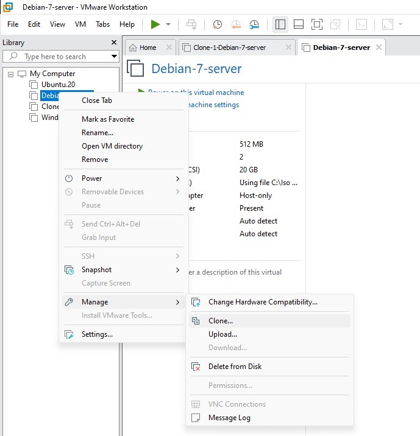

## 2. Menginstall Windows Xp
- Pertama-tama, Download cd `Windows Xp` agar bisa dimasukan ke VmWare
- Kedua, Create a new virtual Machine pada Vmware, `pilih Typical`

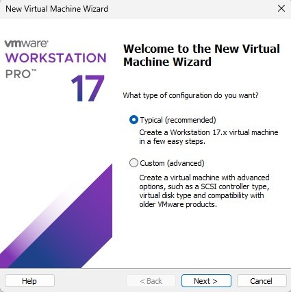 

- Ketiga, Masukan CD `Windows Xp` yang kalian sudah download     

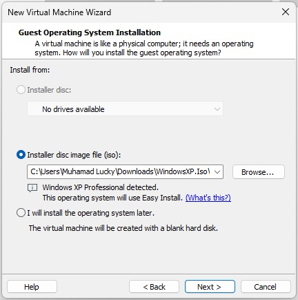

- Lanjutkan Sampai Selesai Menginstal `Windows Xp`

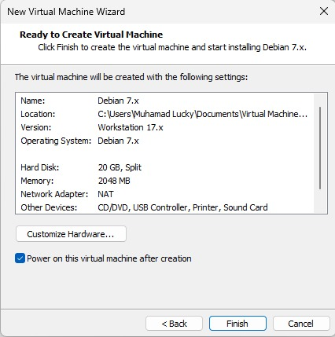

- Keempat nyalakan Windows Xp dan Tunggu penginstalan sofware Windows Xp
- Kelima, Masukan CD key jika di perlukan
- Keenam, Tunggu selesai booting Windows XP
- Selesai

## 3. Mengubah Windows Xp menjadi Segmen di vm Debian
- Pertama, Buka Virtual machine setting di `clone-debian-7-server` jangan di `Debian-7-Server`

- Kedua, pilih `Network Adapter`, lalu add dengan nama segmen-1

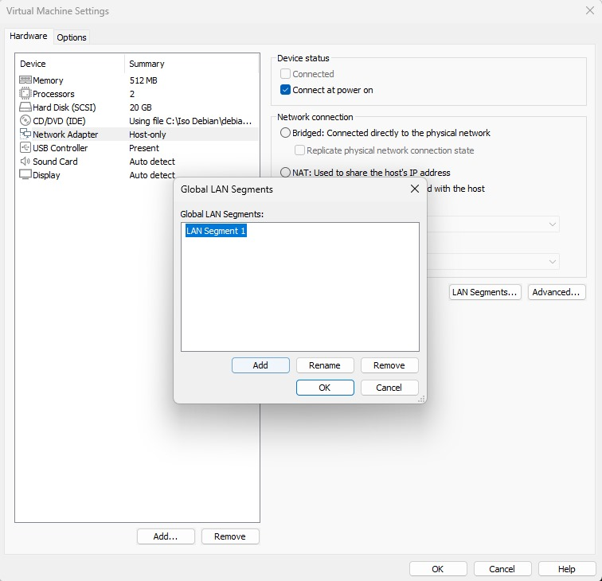

- Ketiga, Pilih klik dropdown menu ke segmen-1

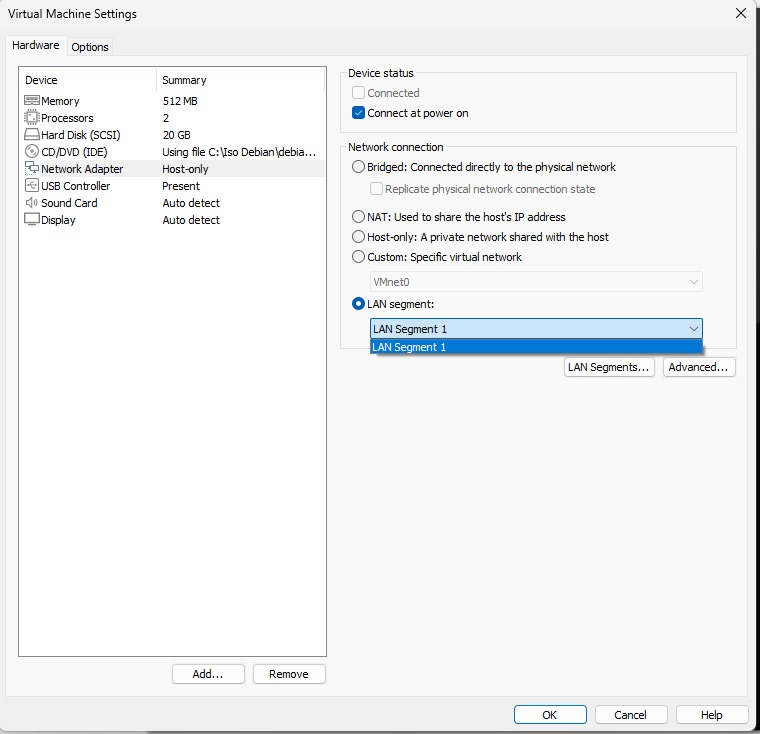

## 4. Mengkonfigurasi IP Dari Debian-Server
- Pertama - tama, start Clone-Debian-7-Server
- Kedua, konfigurasi IP pada debian menggunakan super user atau root konfigurasi ini berada pada file, dengan menggunakan code dibawah ini :

```
nano /etc/network/interfaces
```

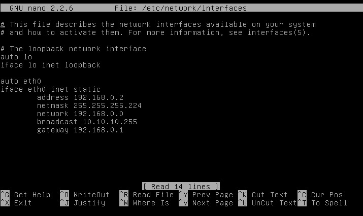

Ikuti Ip diatas untuk mengkonfigurasi Interfaces dalam `Debian-Server`.

- Ketiga, Setelah Mengkonfigurasi IP kita, kita harus merestart service networking dengan cara :
 
```
service networking restart
```

Tunggu beberapa saat lalu cara kita bisa melihat hasil dengan command:

```
ip config / ip a
```

Dan tampilan ip a, akan seperti ini:


- Keempat, Masukan Cd 2 pada VmWare kalian dengan cara : 
`Click Vm pada tampilan atas kiri, 
removable device,
CD/DVD(IDE), 
lalu setting.`

Seperti gambar di bawah:

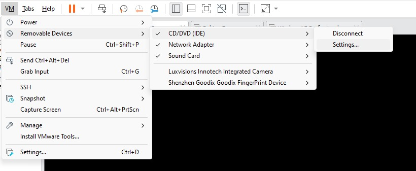

- Kelima, masukan CD iso-debian-DVD-2.iso

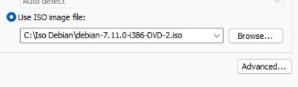

- Keenam, Setelah memasukan CD 2, install service dhcp server terlebih dahulu dengan menggunakan command:

```
apt-get install isc-dhcp-server
```

- Ketujuh, setelah selesai menginstall service, lalu nano dhcp.conf:

```
nano /etc/dhcp/dhcpd.conf
```

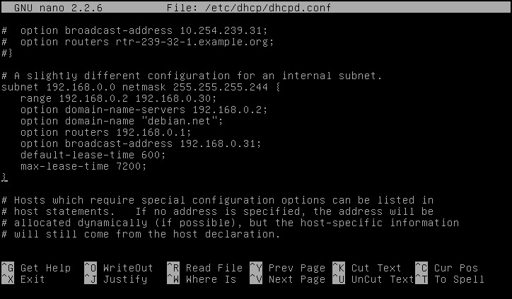

ikuti gambar diatas dengan cara `menghapus symbol # dari subnet sampai tanda }`

- ke delapan, edit file default dhcp seperti berikut:

```
nano /etc/default/isc-dhcp-server
```

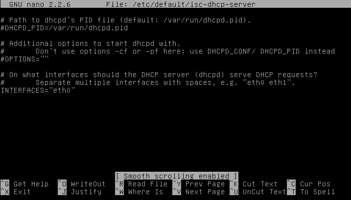

- ke sembilan, jika sudah gunakan command dibawah untuk mengrestart dhcp server:

```
service isc-dhcp-server restart
```

- Ke sepuluh, start isc-dhcp-server dengan menggunakan command dibawah:

```
service isc-dhcp-server start
```

- Dan yang terakhir, lakukan pengujian di client windows XP

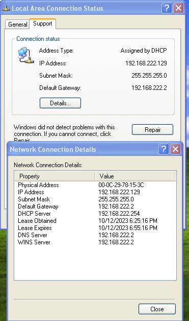

Terima Kasih telah melihat projek DHCP saya, semoga bermanfaat.
