# VMware Machines Setup & DHCP Server Deployment

Selamat datang di panduan DHCP Server *Deployment*! Proyek ini mendemonstrasikan instalasi dan konfigurasi IP-Address Server berbasis dhcp di lingkungan linux (Debian 7) dan Windows (XP) sebagai penerima IP DHCP.

---

## 💡 Ringkasan Proyek

!!! abstract "Tujuan & Ruang Lingkup"
    Proyek ini bertujuan untuk membangun *full-stack web server* menggunakan **LAMP (Linux, Apache, MySQL, PHP)** di Debian 12, dengan fokus pada hosting platform WordPress. Anda akan belajar:
    Menyiapkan lingkungan server Linux,
    Menginstal dan mengkonfigurasi *web server* (Apache2) dan *database server* (MySQL),
    Menyebarkan aplikasi WordPress dan mengkonfigurasinya untuk akses web.

---

## ⚙️ Teknologi yang Digunakan

*   :material-linux: **Sistem Operasi:** Debian 12 (Bookworm)
*   :material-microsoft-windows: **Sistem Pengetesan:** Windows XP 

---

## 🚀 Langkah-langkah Implementasi

### 1. :material-cog: Setting DHCP Server 
- pertama-tama, download debian 7 di VmWare sebagai `server`  
- Kedua, Buat clone pada Debian 7 server `agar tidak install berkali-kali`

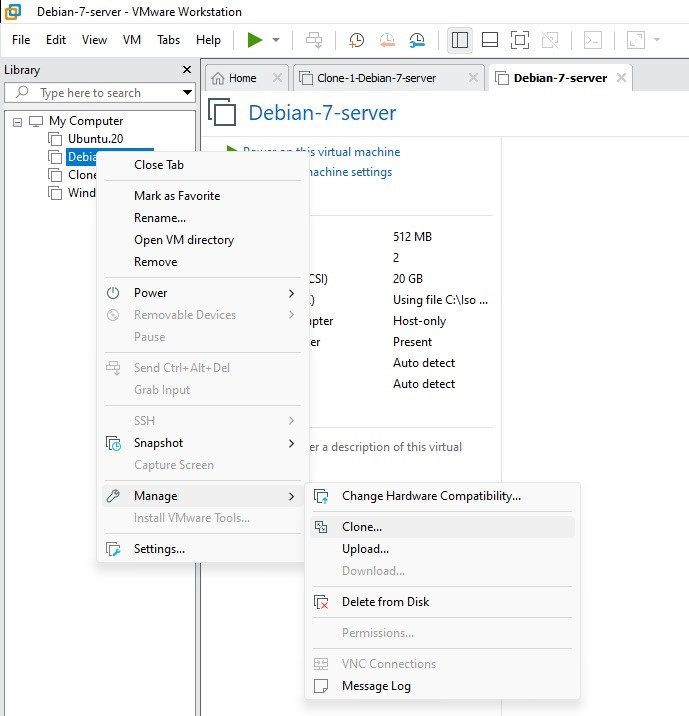

### 2. :material-download: Menginstall Windows Xp
- Pertama-tama, Download cd `Windows Xp` agar bisa dimasukan ke VmWare
- Kedua, Create a new virtual Machine pada Vmware, `pilih Typical`

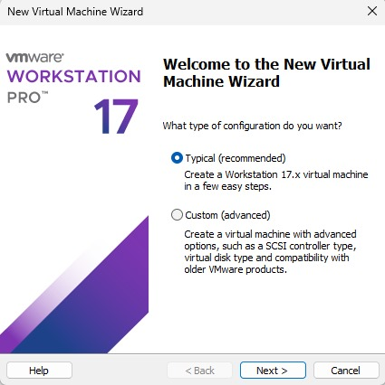 

- Ketiga, Masukan CD `Windows Xp` yang kalian sudah download     

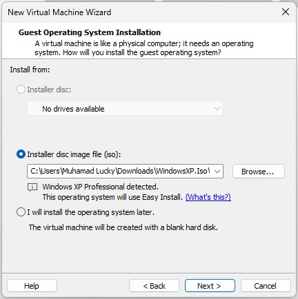

- Lanjutkan Sampai Selesai Menginstal `Windows Xp`

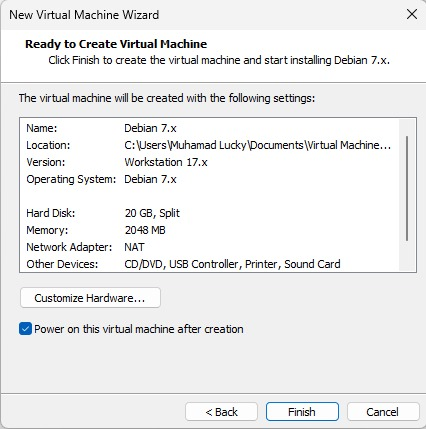

- Keempat nyalakan Windows Xp dan Tunggu penginstalan sofware Windows Xp
- Kelima, Masukan CD key jika di perlukan
- Keenam, Tunggu selesai booting Windows XP
- Selesai

### 3. :material-file-move: Mengubah Windows Xp menjadi Segmen di vm Debian
- Pertama, Buka Virtual machine setting di `clone-debian-7-server` jangan di `Debian-7-Server`

- Kedua, pilih `Network Adapter`, lalu add dengan nama segmen-1

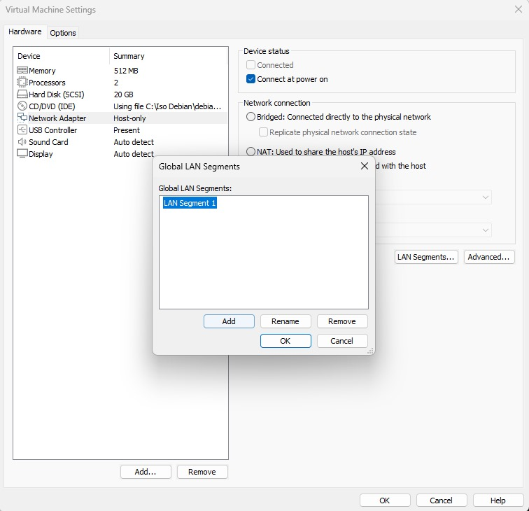

- Ketiga, Pilih klik dropdown menu ke segmen-1

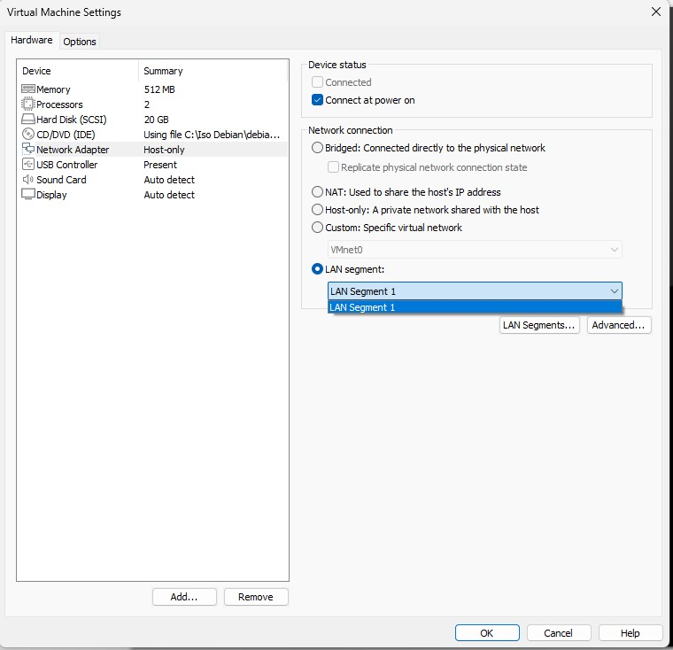

### 4. :material-file-edit: Mengkonfigurasi IP Dari Debian-Server
- Pertama - tama, start Clone-Debian-7-Server
- Kedua, konfigurasi IP pada debian menggunakan super user atau root konfigurasi ini berada pada file, dengan menggunakan code dibawah ini :

```
nano /etc/network/interfaces
```

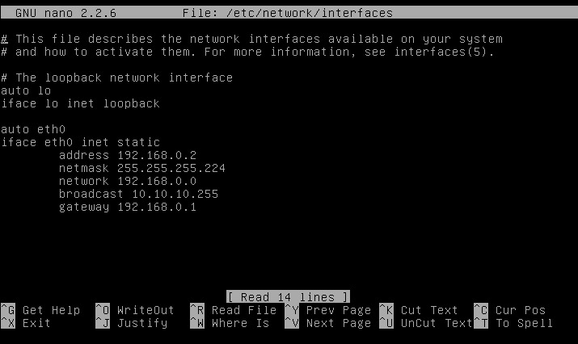

Ikuti Ip diatas untuk mengkonfigurasi Interfaces dalam `Debian-Server`.

- Ketiga, Setelah Mengkonfigurasi IP kita, kita harus merestart service networking dengan cara :
 
```
service networking restart
```

Tunggu beberapa saat lalu cara kita bisa melihat hasil dengan command:

```
ip config / ip a
```

Dan tampilan ip a, akan seperti ini:

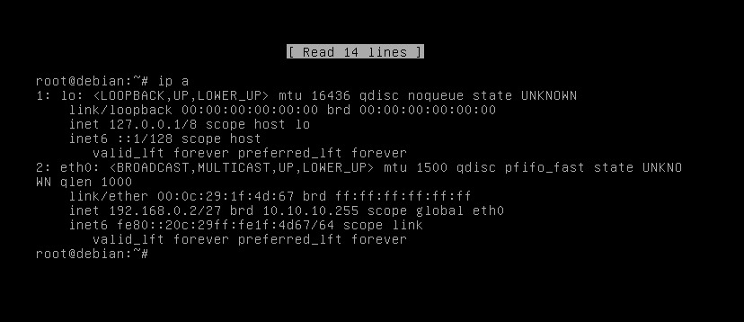

- Keempat, Masukan Cd 2 pada VmWare kalian dengan cara : 
`Click Vm pada tampilan atas kiri, 
removable device,
CD/DVD(IDE), 
lalu setting.`

Seperti gambar di bawah:

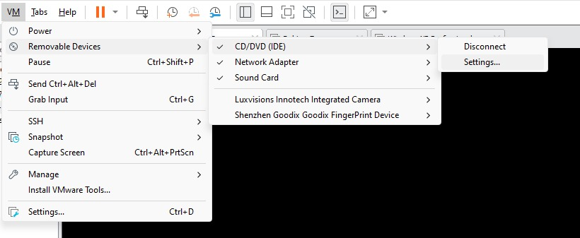

- Kelima, masukan CD iso-debian-DVD-2.iso

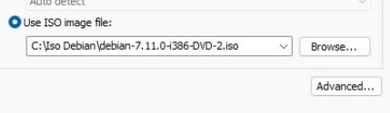

- Keenam, Setelah memasukan CD 2, install service dhcp server terlebih dahulu dengan menggunakan command:

```
apt-get install isc-dhcp-server
```

- Ketujuh, setelah selesai menginstall service, lalu nano dhcp.conf:

```
nano /etc/dhcp/dhcpd.conf
```

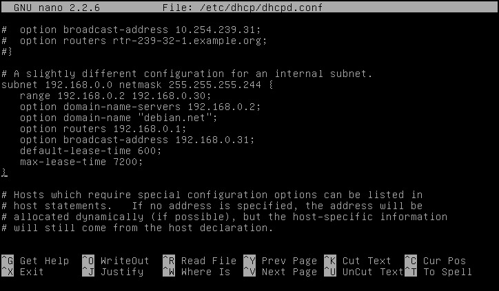

ikuti gambar diatas dengan cara `menghapus symbol # dari subnet sampai tanda }`

- ke delapan, edit file default dhcp seperti berikut:

```
nano /etc/default/isc-dhcp-server
```

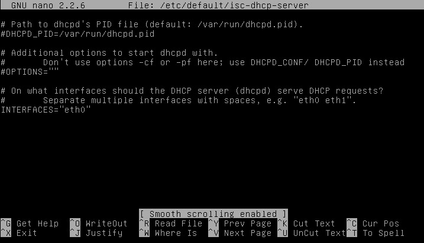

- ke sembilan, jika sudah gunakan command dibawah untuk mengrestart dhcp server:

```
service isc-dhcp-server restart
```

- Ke sepuluh, start isc-dhcp-server dengan menggunakan command dibawah:

```
service isc-dhcp-server start
```

---

## ✅ Hasil Akhir

!!! success "Verifikasi Alokasi IP DHCP"
    Anda kini telah berhasil menginstal dan mengkonfigurasi DHCP-Server di server Debian 7. 

    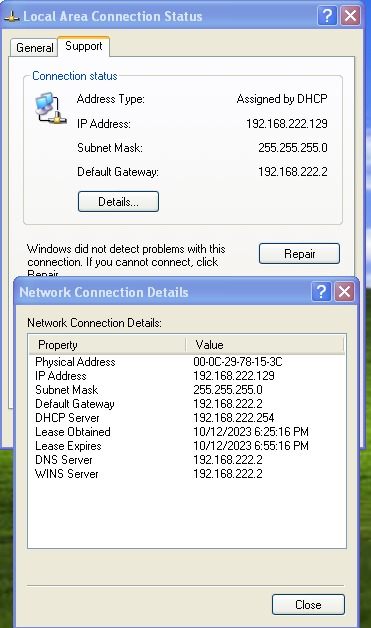{ width="400" loading="lazy" }
    <p>*Gambar 6.1: Tampilan Windows XP yang sudah menerima IP-DHCP pada Server Debian 7.*</P>

---

## 🧐 Tantangan & Solusi

!!! bug "Klien Tidak Mendapatkan Alamat IP"
    *   **Status Layanan DHCP:** Pastikan layanan ISC DHCP Server berjalan di Debian (`sudo systemctl status isc-dhcp-server`).
    *   **Konfigurasi Jaringan VM:** Pastikan VM Debian dan Windows XP berada di segmen jaringan yang sama di VMware (misal: "LAN Segment" atau "Host-only Network").
    *   **Firewall:** Periksa apakah ada aturan *firewall* di Debian yang memblokir port DHCP (UDP 67/68). Nonaktifkan sementara atau izinkan port tersebut.
    *   **Konfigurasi `dhcpd.conf`:** Periksa kembali file konfigurasi DHCP Anda (`/etc/dhcp/dhcpd.conf`) untuk kesalahan sintaks atau rentang IP yang tidak valid.

---

## 🚀 Pengembangan Lanjutan

!!! tip "Ide Peningkatan Proyek DHCP"
    *   **Reservasi Alamat IP (Static Leases):** Konfigurasi DHCP Server untuk selalu memberikan alamat IP yang sama ke perangkat tertentu berdasarkan MAC address-nya.
    *   **DHCP Relay Agent:** Implementasikan DHCP Relay di router untuk melayani klien DHCP di segmen jaringan yang berbeda.
    *   **Integrasi DNS:** Konfigurasikan DHCP Server untuk secara otomatis memperbarui *record* DNS saat klien mendapatkan alamat IP baru.
    *   **DHCP Failover:** Bangun dua DHCP Server untuk redundansi, memastikan layanan tidak terputus jika salah satu server gagal.
    *   **Keamanan DHCP:** Terapkan langkah-langkah keamanan dasar untuk DHCP, seperti *port security* atau *DHCP snooping* di switch virtual.
---


