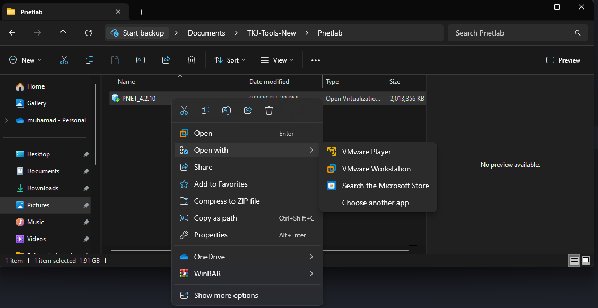
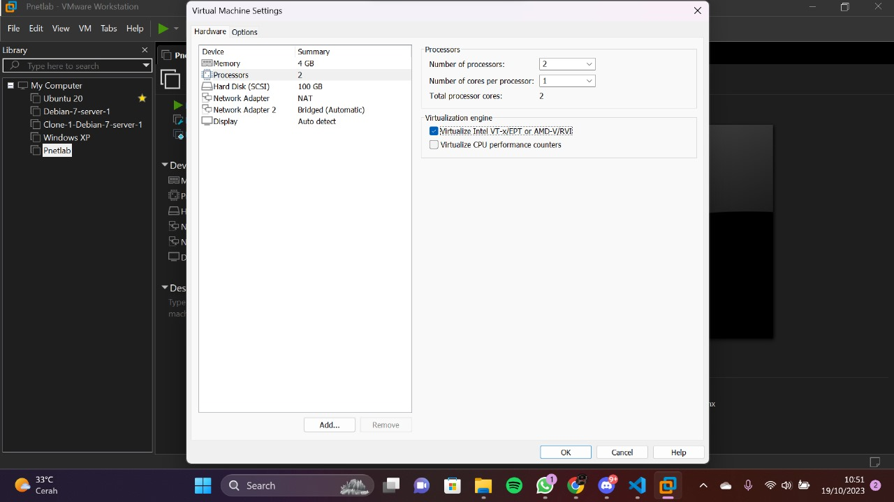
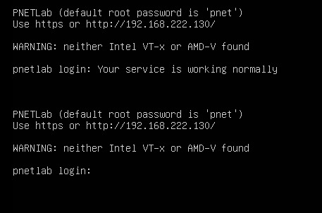
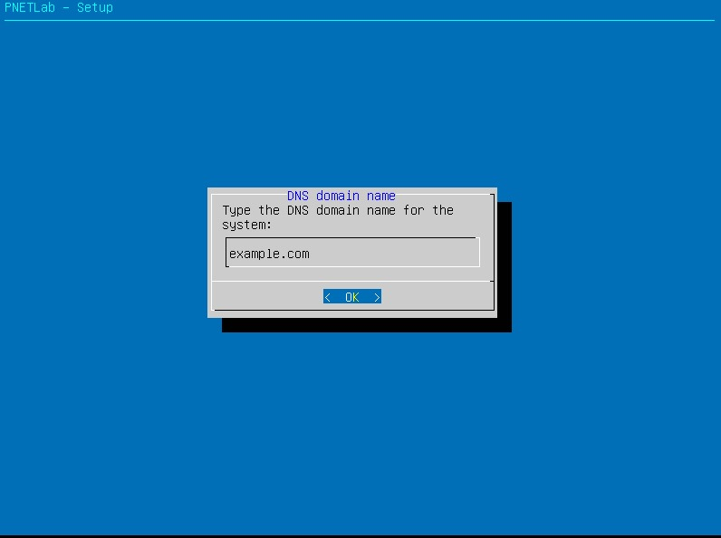
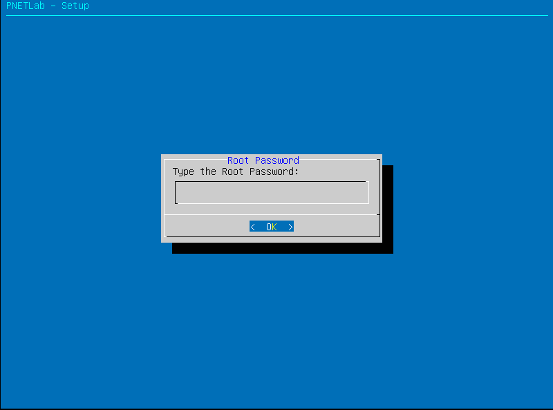
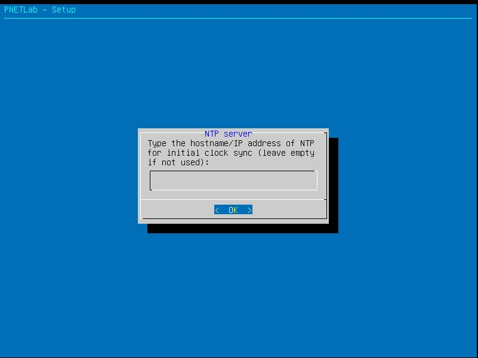
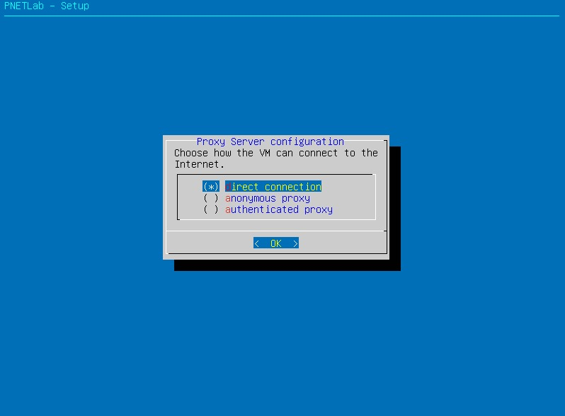
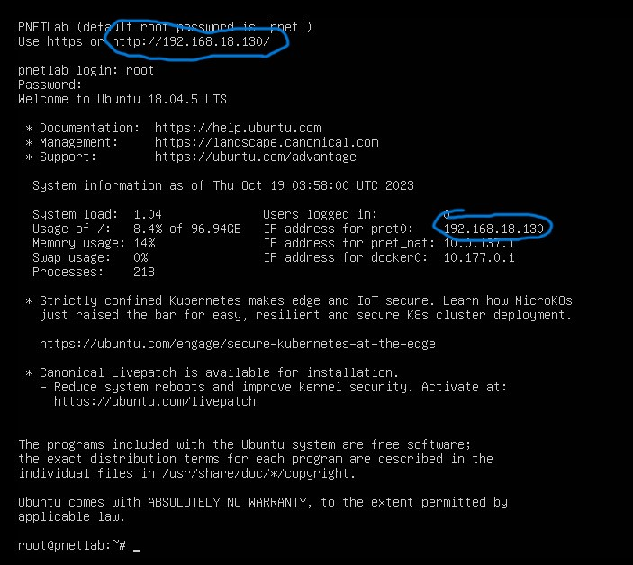

# Cara Install PNETLab Dengan vmware

## 1. Cara Mendownload PnetLab 

- Pertama - tama, download pnetlab dari browser dibawah

[Download PNETLab](https://pnetlab.com/pages/download){ .md-button .md-button--primary }

- Kedua, Setelah selesai mendownload Pnetlab. buka folder Pnetlab, click kanan dan open with VmWare. Seperti gambar dibawah:

- ketiga, Masukan nama `PnetLab` di bagian import

- Keempat, Setelah selesai import. Setting PNETLab seperti gambar dibawah:

Sudah Setting PnetLab seperti diatas, Nyalakan Pnetlab

## 2. Mengkonfigurasi PNETLab

-  Pertama, tuggu Selesai startup boot PNETLab

- Kedua, Login PNETLab dengan dibawah ini :
`login: root`
`pasword: pnet`

- Ketiga, buatlah domain sendiri dan password baru untuk PNETLab anda seperti digambar:

- Keempat, Lanjut isi semua secara opsional

- Kelima, jika anda selesai mengkonfigurasi PNETLab. tunggu restart boot.

- Keenam, Masukan `login: root` dan `password: (Yang tadi kalian buat saat pembuatan password)`

- Setelah login, lihat ip diatas dan masukan ke dalam google chrome/internet browser lainnya. Contoh IP PNETLab ada di bawah:

