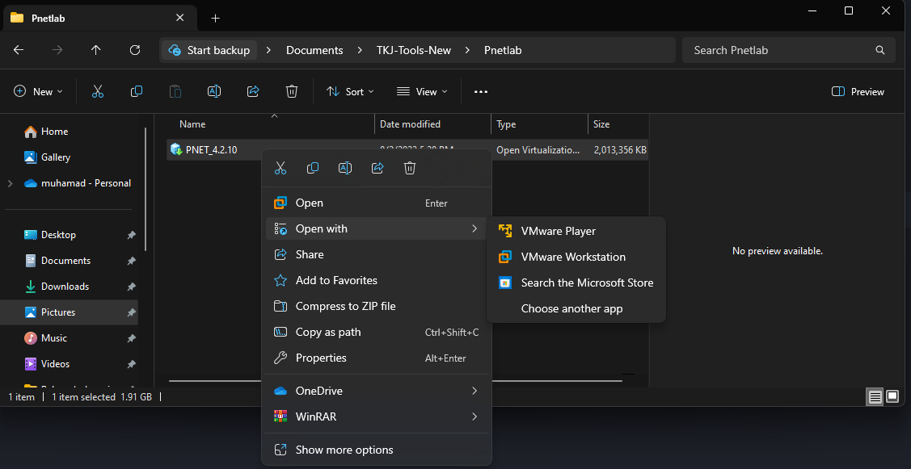
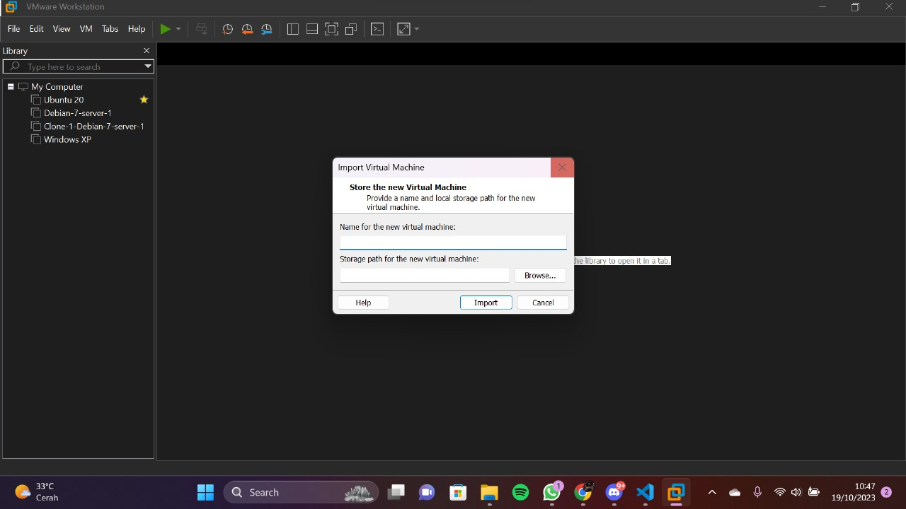
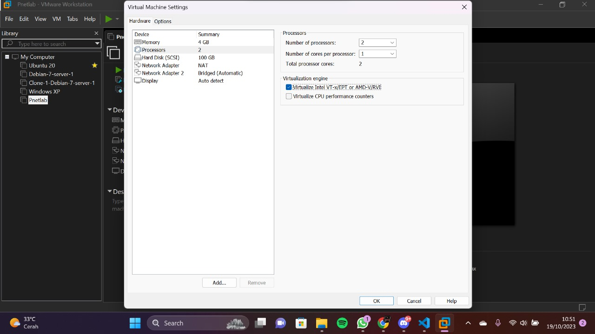
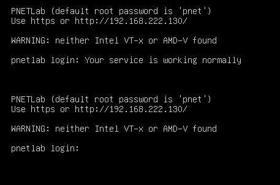
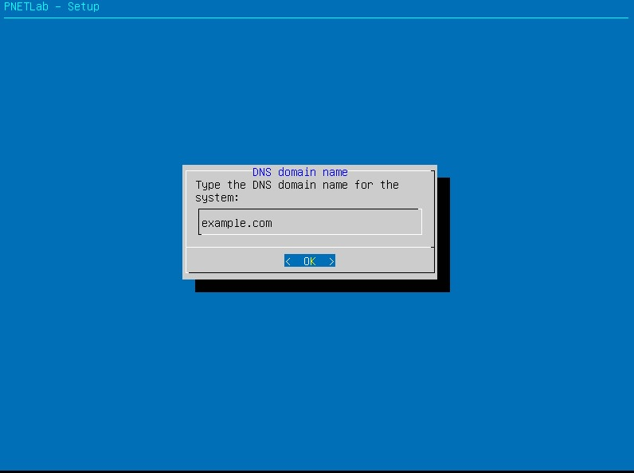
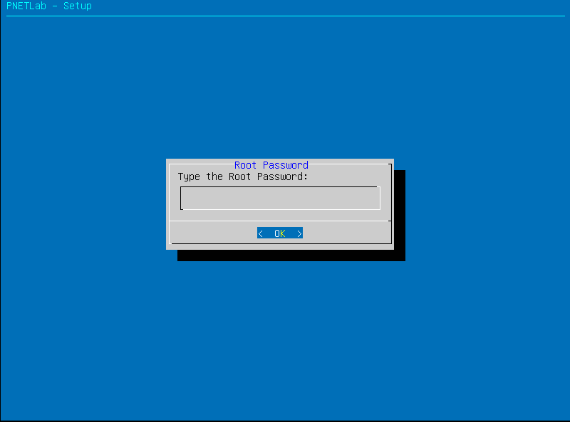
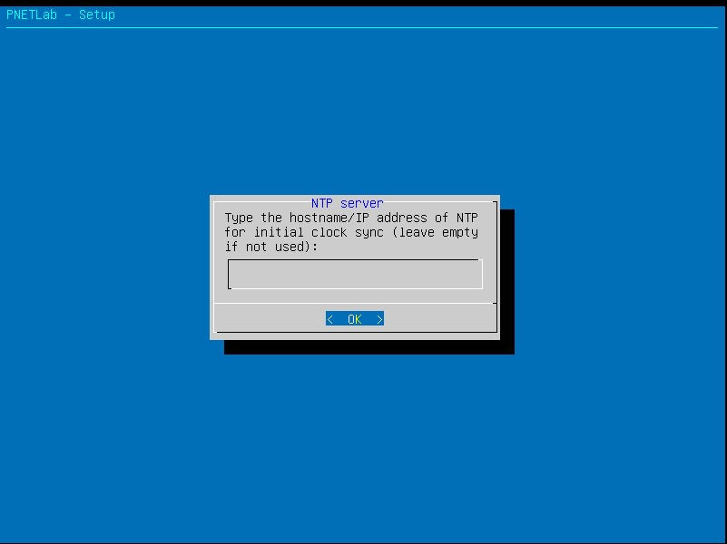
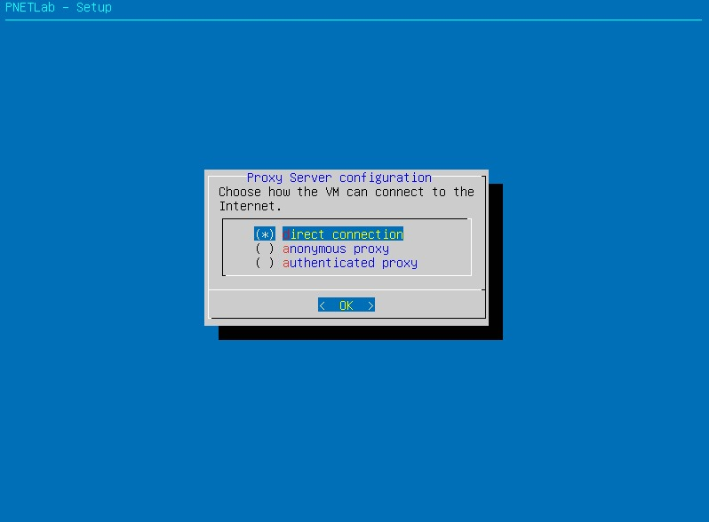
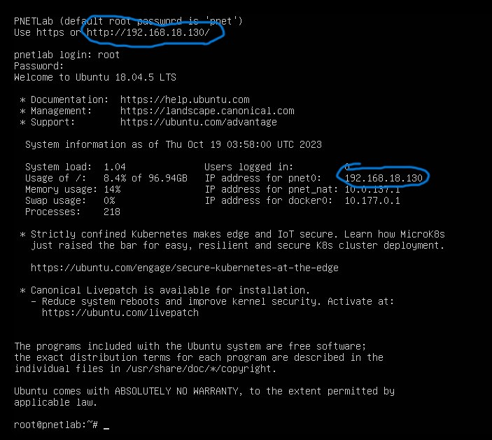

# PNETLAB Network Simulations

Selamat datang di laboratorium virtual PNETLab! Proyek ini mendemonstrasikan perancangan, konfigurasi, dan simulasi berbagai topologi jaringan secara *real-time*. Di sini, kita akan mengeksplorasi bagaimana berbagai perangkat jaringan berinteraksi dalam lingkungan simulasi yang mendekati kondisi infrastruktur nyata.

---

## 💡 Ringkasan Proyek

!!! abstract "Tujuan & Ruang Lingkup"
    Proyek ini bertujuan untuk membangun lingkungan simulasi jaringan yang kompleks menggunakan platform PNETLab. Fokus utama mencakup integrasi berbagai *nodes* (Router, Switch, Server), pengujian protokol routing, serta validasi konektivitas antar perangkat virtual. Anda akan belajar cara mengelola *lab environment*, melakukan *inter-device cabling* secara virtual, dan memantau lalu lintas data dalam simulasi.

---

## ⚙️ Teknologi yang Digunakan

* :material-lan: **Simulator:** PNETLab (Performance Network Emulation Lab)
* :material-server: **Nodes:** PNET_4.2.10 (Server), Mikrotik/Cisco IOS (Routing)
* :material-monitor: **Client:** Windows 10 / WebTerm (Testing)

---

## 🚀 Langkah-langkah Implementasi

### 1. :material-download: Cara Mendownload PnetLab 

- Pertama - tama, download pnetlab dari browser dibawah

[Download PNETLab](https://pnetlab.com/pages/download){ .md-button .md-button--primary }

- Kedua, Setelah selesai mendownload Pnetlab. buka folder Pnetlab, click kanan dan open with VmWare. Seperti gambar dibawah:

- ketiga, Masukan nama `PnetLab` di bagian import

- Keempat, Setelah selesai import. Setting PNETLab seperti gambar dibawah:

Sudah Setting PnetLab seperti diatas, Nyalakan Pnetlab

### 2. :material-file-edit: Mengkonfigurasi PNETLab

-  Pertama, tuggu Selesai startup boot PNETLab

- Kedua, Login PNETLab dengan dibawah ini :
`login: root`
`pasword: pnet`

- Ketiga, buatlah domain sendiri dan password baru untuk PNETLab anda seperti digambar:

- Keempat, Lanjut isi semua secara opsional

- Kelima, jika anda selesai mengkonfigurasi PNETLab. tunggu restart boot.

- Keenam, Masukan `login: root` dan `password: (Yang tadi kalian buat saat pembuatan password)`

- Setelah login, lihat ip diatas dan masukan ke dalam google chrome/internet browser lainnya. Contoh IP PNETLab ada di bawah:

### 3. :material-firefox: Pengetesan PNETLab Dengan Firefox

- Akses PNETLab ke Firefox dengan IP PNETLab
- Pilih Offline Mode 

- untuk default password PNETLab bisa diakses dengan `Username: admin` `pasword: pnet`

---

## 🧐 Tantangan & Solusi

!!! danger "Node Tidak Dapat Terhubung (No Connectivity)"

    * **Kesesuaian Image:** Pastikan QEMU/IOL image yang digunakan sudah di-uncompress dan memiliki izin akses yang benar (`/opt/unetlab/wrappers/unl_wrapper -a fixpermissions`).
    * **Virtual Interface:** Periksa apakah jenis interface yang dipilih (e1000, virtio-net-pci) didukung oleh OS node tersebut. Jika node gagal booting, coba ganti ke jenis interface yang lebih kompatibel.
    * **Resource Limit:** Simulasi PNETLab memakan RAM dan CPU yang besar. Jika node sering *hang*, kurangi alokasi RAM pada pengaturan individual node sebelum dinyalakan.
    * **Cabling Error:** Verifikasi koneksi kabel virtual pada tab *Topology*. Terkadang kabel terlihat terhubung namun secara sistem belum terdeteksi pada interface yang benar.

---

## 🚀 Pengembangan Lanjutan

!!! info "Ide Peningkatan Proyek PNETLab"

    * **External Cloud Connection:** Menghubungkan lab virtual ke internet nyata menggunakan *Management Cloud* agar node bisa melakukan update paket secara langsung.
    * **Adding an Node/Device:** Menambahkan Node atau Device untuk belajar device Router/Switch dengan merek yang akan di pakai pada perusahaan seperti Ruijie, Mikrotik, UniFi, Cisco, Juniper, dan lain-lainnya. 

