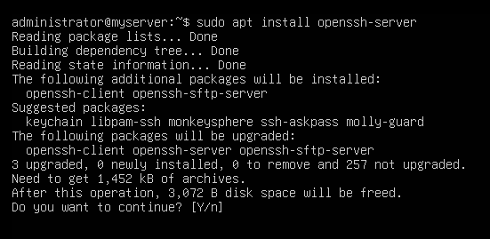
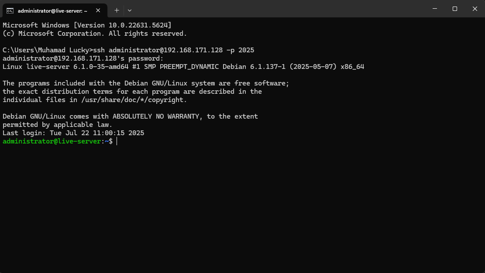

# Cara menggunakan SSH pada Linux


## 1. Mendownload Ubuntu 

- Pertama - tama, download Ubuntu versi terbaru yaitu 24.04.2 (Noble Numbat)

[Download Ubuntu 24 Version](https://releases.ubuntu.com/noble/ubuntu-24.04.2-live-server-amd64.iso){ .md-button .md-button--primary }

- Atau jika laptop anda tidak kuat maka bisa mendownload ubuntu stable version yaitu 20.04.6 LTS

[Download Ubuntu 20 Version](https://releases.ubuntu.com/focal/ubuntu-20.04.6-live-server-amd64.iso){ .md-button .md-button--primary }

## 2. Instalasi Ubuntu live-server ke dalam Virtual Machine

- Jika kalian sudah menyelesaikan instalasi Ubuntu Server", maka kalian bisa menonton video youtube dibawah dengan penjelasan yang sudah saya berikan secara rinci :

[Tutorial install ubuntu server](https://www.youtube.com/watch?v=gbq_7OYpJqM){ .md-button .md-button--primary }

## 3. Login ke dalam Ubuntu server

- Silahkan login dengan user yang telah anda buat dan tampilan jika anda sudah login akan seperti dibawah:


## 4. Sebelum install openssh, silahkan update terlebih dahulu

- karena ingin menggunakan versi ssh yang optimal, maka kita harus update terlebih dahulu dikarenakan iso yang kita install sebelumnya belum termasuk versi terbaru, melainkan yang lama.

```
sudo apt update
```


## 5. Instalasi openssh

- Pertama install server dan klien SSH untuk mengaktifkan layanan SSH:

```
sudo apt instal openssh-server
```



## 6. Configurasi openssh

- masuk ke dalam :

```
sudo nano /etc/ssh/sshd_config
```

- ganti port dan allow permitrootlogin pada sshd_config

```
port (terserah)
PermitRootLogin yes
```


## 7. restart ssh 

- Restart ssh anda agar dapat mengimplementasikan configurasi ssh yang telah anda ganti:

```
sudo systemctl restart ssh
sudo systemctl start ssh
```

## 8. Cek ip address yang kalian dapat melalui dhcp

- cek ip kalian dengan:

```
ip a
```

- lalu masukan ip kalian dengan port yang kalian sudah kalian masukan melalui `cmd ataupun putty`, untuk cmd bisa seperti ini:

```
ssh 192.168.7.1@administrator -p 2025
```


- ketik yes lalu masukan password



Selamat anda telah menyelesaikan instalasi ssh pada server anda

📌 Apa sih kegunaan dari SSH?
SSH (Secure Shell) adalah protokol jaringan yang digunakan untuk mengakses dan mengelola sistem komputer secara jarak jauh melalui koneksi yang aman dan terenkripsi.


### ✅ Kegunaan utama SSH:
1. Akses remote ke server
SSH memungkinkan kamu mengontrol server Linux dari mana saja tanpa harus berada di depan perangkat fisik.

2. Transfer file aman (SCP / SFTP)
Dengan SSH, kamu bisa mengirim atau mengambil file dari server menggunakan protokol aman seperti SCP dan SFTP.

3. Administrasi sistem
Administrator jaringan menggunakan SSH untuk menjalankan perintah, memperbarui sistem, atau menginstal software dari jarak jauh.

4. Tunneling dan port forwarding
SSH juga bisa digunakan untuk mengamankan koneksi ke layanan lain, misalnya mengakses database secara aman melalui SSH tunnel.

5. Otomatisasi dengan SSH key
Menggunakan SSH key memungkinkan login otomatis tanpa password, sangat berguna untuk deployment otomatis dan DevOps.


