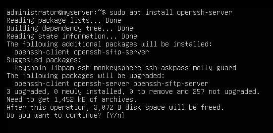
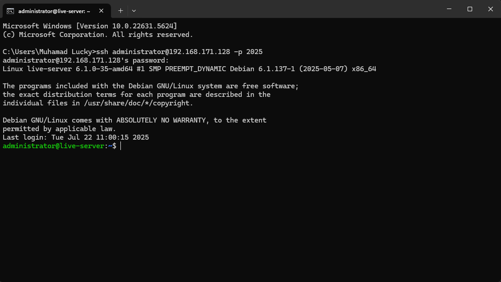

# Secure Remote Access with SSH

Selamat datang di modul keamanan jaringan! Proyek ini mendemonstrasikan implementasi protokol SSH (Secure Shell) untuk mengelola perangkat server dan jaringan secara aman dari jarak jauh. Di sini, kita akan mempraktikkan cara mengganti metode login password yang rentan dengan autentikasi berbasis kunci (Key-based Authentication).

---

## 💡 Ringkasan Proyek

!!! abstract "Tujuan & Ruang Lingkup"
    Proyek ini bertujuan untuk mengamankan jalur komunikasi administratif antara administrator dan infrastruktur server di dalam PNETLab. Fokus utama mencakup instalasi OpenSSH Server, konfigurasi pengerasan (hardening) SSH, serta penggunaan SSH Key Pair untuk mencegah serangan *brute-force*. Anda akan belajar cara menghasilkan kunci RSA/Ed25519, menonaktifkan login root, dan mengubah port standar untuk meningkatkan keamanan.

---

## ⚙️ Teknologi yang Digunakan

* :material-shield-lock: **Protokol:** SSH (Secure Shell) v2
* :material-linux: **Server:** Ubuntu 24.04.2 LTS/Debian 13 Server (Noble Numbat)
* :material-console: **Tools:** OpenSSH, PuTTY / Terminal, ssh-keygen

---

## 🚀 Langkah-langkah Implementasi

### 1. :material-cog: Mendownload Ubuntu 

- Pertama - tama, download Ubuntu versi terbaru yaitu 24.04.2 (Noble Numbat)

[Download Ubuntu 24.04.4 LTS](https://ubuntu.com/download/server/thank-you?version=24.04.4&architecture=amd64&lts=true){ .md-button .md-button--primary }

- Atau jika laptop anda tidak kuat maka bisa menginstall debian 13 untuk distro yang lebih stabil dan ringan

[Download Debian 13 Version](https://cdimage.debian.org/debian-cd/current/amd64/iso-cd/debian-13.4.0-amd64-netinst.iso){ .md-button .md-button--primary }

### 2. :material-linux: Instalasi Ubuntu live-server ke dalam Virtual Machine

- Jika kalian sudah menyelesaikan instalasi Ubuntu Server", maka kalian bisa menonton video youtube dibawah dengan penjelasan yang sudah saya berikan secara rinci :

[Tutorial install ubuntu server](https://www.youtube.com/watch?v=gbq_7OYpJqM){ .md-button .md-button--primary }

### 3. :material-login: Login ke dalam Ubuntu server

- Silahkan login dengan user yang telah anda buat dan tampilan jika anda sudah login akan seperti dibawah:


### 4. :material-update: Sebelum install openssh, silahkan update terlebih dahulu

- karena ingin menggunakan versi ssh yang optimal, maka kita harus update terlebih dahulu dikarenakan iso yang kita install sebelumnya belum termasuk versi terbaru, melainkan yang lama.

```
sudo apt update
```


### 5. :material-ssh: Instalasi openssh

- Pertama install server dan klien SSH untuk mengaktifkan layanan SSH:

```
sudo apt instal openssh-server
```



### 6. :material-folder-open: Configurasi openssh

- masuk ke dalam :

```
sudo nano /etc/ssh/sshd_config
```

- ganti port dan allow permitrootlogin pada sshd_config

```
port (terserah)
PermitRootLogin yes
```


### 7. :material-restart: restart ssh 

- Restart ssh anda agar dapat mengimplementasikan configurasi ssh yang telah anda ganti:

```
sudo systemctl restart ssh
sudo systemctl start ssh
```

### 8. Cek ip address yang kalian dapat melalui dhcp

- cek ip kalian dengan:

```
ip a
```

- lalu masukan ip kalian dengan port yang kalian sudah kalian masukan melalui `cmd ataupun putty`, untuk cmd bisa seperti ini:

```
ssh 192.168.7.1@administrator -p 2025
```


- ketik yes lalu masukan password



Selamat anda telah menyelesaikan instalasi ssh pada server anda

## ✅ Hasil Akhir

!!! success "SSH Berhasil Diakses!"
    Anda kini telah berhasil mengonfigurasi Ubuntu 24.04 LTS sebagai SSH Server yang aman. Akses jarak jauh kini dapat dilakukan menggunakan enkripsi kunci, memastikan integritas dan kerahasiaan data administratif Anda.

    { width="800" loading="lazy" }
    <p>*Gambar 6.1: Tampilan terminal saat berhasil login menggunakan SSH Key.*</p>

---

## 🧐 Tantangan & Solusi

!!! bug "Masalah: Connection Refused atau Timeout"
    Jika Anda tidak dapat terhubung ke server, pastikan:
    1.  **Status Layanan:** Pastikan modul SSH berjalan di server (`sudo systemctl status ssh`).
    2.  **Firewall (UFW):** Pastikan port SSH (default: 22 atau port custom Anda) sudah diizinkan (`sudo ufw allow ssh` atau `sudo ufw allow [port]`).
    3.  **IP Address:** Pastikan IP address server benar dan berada dalam jaringan yang dapat dijangkau oleh client.

!!! warning "Masalah: Permission Denied (publickey)"
    Ini terjadi ketika kunci privat Anda tidak cocok atau tidak terdaftar di server. Periksa:
    1.  **Authorized Keys:** Pastikan isi file `id_rsa.pub` client sudah disalin dengan benar ke file `~/.ssh/authorized_keys` di server.
    2.  **Izin Folder .ssh:** Folder `.ssh` di server harus memiliki izin `700` dan file `authorized_keys` harus `600` (`chmod 600 ~/.ssh/authorized_keys`).

---

## 🚀 Pengembangan Lanjutan

!!! tip "Ide Pengembangan Selanjutnya:"
    * **Disable Password Authentication:** Matikan login password sepenuhnya di `/etc/ssh/sshd_config` agar server hanya bisa diakses via SSH Key (mencegah *brute-force*).
    * **Custom SSH Port:** Ubah port default 22 ke port yang tidak umum (misal: 2244) untuk mengurangi upaya pemindaian bot otomatis.
    * **SSH Tunneling:** Gunakan SSH untuk melakukan *port forwarding* guna mengakses layanan internal (seperti database atau web dashboard) secara aman melalui tunnel terenkripsi.
    * **Two-Factor Authentication (2FA):** Tambahkan lapisan keamanan ekstra dengan Google Authenticator atau Duo untuk login SSH.

---
