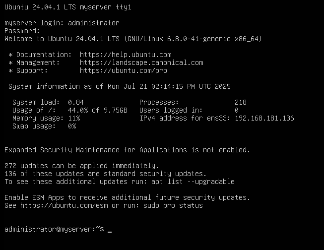

## i. Pengertian wordpress dan cms

- WordPress adalah software berbasis open-source (gratis) yang berfungsi untuk membangun website tanpa membutuhkan pengetahuan coding. Dibangun dengan bahasa pemrograman PHP dan berbasis MySQL, kamu bisa dengan mudah mengelola tiap website yang kamu buat. Fleksibilitas WordPress juga dapat dibuktikan dengan beragamnya jenis situs yang bisa kamu bangun, mulai dari blog pribadi, toko online, situs berita, portofolio pribadi, dan masih banyak lagi. Hal itu dikarenakan, WordPress menyuguhkan ribuan template dan plugin yang membuat aktivitas pengelolaan website jadi lebih seamless. Dengan WordPress, nantinya kamu hanya perlu fokus terhadap produksi konten, sementara hal-hal berkenaan dengan fitur, keamanan, dan pengaturan teknis lainnya tidak perlu kamu pusingkan.

##  ii. Cara mendownload dan mengconfigurasi wordpress dengan linux (debian 12)

## 1. login ke dalam linux server:

- Silahkan login linux kalian dengan ubuntu atau debian:



## 2. Membuat Database

- install MySQL

```
sudo apt install default-mysql-server -y
```


- masuk ke database mysql

```
sudo mysql -u root -p
```


- lalu ketik:

```OL
CREATE DATABASE wordpress_db;
CREATE USER 'wp_user'@'localhost' IDENTIFIED BY 'passwordku123';
GRANT ALL PRIVILEGES ON wordpress_db.* TO 'wp_user'@'localhost';
FLUSH PRIVILEGES;
EXIT;
```


## 3. Install apache2, php, dan file wordpress yang digunakan untuk web server dan side-server wordpress.

```
sudo apt install php php-mysql libapache2-mod-php php-cli php-curl php-gd php-mbstring php-xml php-xmlrpc php-soap php-intl php-zip unzip -y
```


## 4. pindahkan dan beri akses file wordpress

- Masuk ke folder /tmp untuk install file wordpress. Kalian bisa ketik seperti di bawah ini:

```
cd /tmp
wget -c https://wordpress.org/latest.tar.gz
```


- lalu kalian bisa extract file tersebut:

```
sudo tar -xf latest.tar.gz
```


- lalu kalian bisa pindahkan ke file apache2:

```
sudo mv wordpress /var/www/
```


## 5. berikan akses untuk folder wordpress

- ubah user folder wordpress agar www-data dapat mengakses folder tersebut:

```
sudo chown -R www-data:www-data /var/www/wordpress
sudo chmod 755 -R /var/www/wordpress
```


## 6. backup configurasi default configuration apache menjadi khusus untuk configurasi wordpress

- silahkan pergi ke apache2 yang berada di:

```
sudo cd /etc/apache2/sites-availables/
```

- cek isi folder dengan `ls` lalu copy untuk meng-backup default configuration:

```
sudo cp 000-default.conf wordpress.conf
```


## 7. configurasi file wordpress apache2

- Silahkan masuk ke file wordpress di apache dan masukan konfigurasi wordpress seperti dibawah:


## 8. aktifkan file wordpress dan matikan file default dalam apache 2

- di step ini kalian bisa aktifkan file wordpress:

```
sudo a2ensite wordpress.conf
```


- lalu bisa matikan file default apache2:

```
sudo a2dissite 000-default.conf
```


## 9. akses dengan browser

- cek ip kalian dengan `ip a` lalu masukan ke dalam browser:


## 10. masukan database linux ke dalam wordpress

- pilih languages pada halaman depan, lalu pencet selanjutnya sampai halaman forum. Dalam halaman forum, kalian masukan database yang telah kalian buat di dalam mysql


- silahkan lanjutkan dengan masukan/buat akun di wordpress:


-  keuntungan kita hosting wordpress sendiri dengan server linux, kalian bisa menggunakan plugin dengan gratis. Hingga, kalian bisa melanjutkan project wordpress yang sebelumnya dengan download `zip file` pada website wordpress kalian, lalu extract ke linux.

## iii. Agar dapat diakses melewati dns dengan bind9

-  jika kalian ingin mengakses wordpress dengan dns (domain name server) silahkan ikuti langkah langkah dibawah ini:

## 1.  install bind9

- silahkan install bind9 dengan perintah:

```
sudo apt install bind9
```

## 2. configurasi bind9 

- masuk ke folder bind9 dengan perintah:

```
cd /etc/bind/
```

- masuk ke dalam directory named.conf.local dengan perintah:

```
sudo nano named.conf.local
```

lalu konfigurasi seperti di bawah:


- copy 2 file bernama `db.local` dan `db.127`, berikan nama yang sesuai konfigurasi `named.conf.local` dengan perintah:

```
sudo cp db.local db.ip
```

- nano `db.ip` lalu konfigurasi seperti dibawah:


```
sudo cp db.127 db.domain
```

- nano `db.domain`, lalu konfigurasi seperti dibawah:


## 3. install powertoys

- jika sudah kalian bisa download yang bernama `PowerToys`, link dibawah:

[Download PowerToys](https://apps.microsoft.com/detail/xp89dcgq3k6vld?hl=en-US&gl=US){ .md-button .md-button--primary }

- jika sudah, silahkan di install dan otomatis microsoft akan merecomendasikan default instalasi

## 4. configurasi hosts pada powertoys

- buka powertoys dan masuk ke halaman `advanced`, lalu bisa pergi ke `hosts file editor`, dan klik `Launch Hosts File Editor` seperti gambar di bawah:


- klik `accept` jika muncul pop up, lalu buatlah entry baru dengan klik pojok atas `new entry`


- masukan domain dan ip yang telah anda buat


- dan kalian bisa akses wordpress dengan domain


## iv. ✅ Keuntungan dan Kelebihan Instalasi WordPress di Linux

-  kenapa sih ga langsung aja bikin wordpress di websitenya langsung? kenapa harus pake linux buat pake wordpress?

| Keuntungan        | Penjelasan                         |
|---------------|-------------------------------------|
| 1. Biaya Lebih Hemat | Linux bersifat open source dan gratis. Tidak perlu lisensi seperti Windows Server. |
| 2. Stabil dan Andal | Server Linux (seperti Debian atau Ubuntu Server) terkenal stabil dan jarang perlu reboot. Cocok untuk layanan web 24/7. |
| 3. Keamanan Tinggi | Linux memiliki manajemen hak akses dan izin file yang kuat, serta komunitas aktif dalam menambal celah keamanan. |
| 4. Performa Lebih Optimal | Linux menggunakan resource lebih efisien daripada Windows, cocok untuk server ringan hingga skala besar. |
| 5. Dukungan komunitas besar | Banyak tutorial, forum, dan dokumentasi tersedia — mulai dari konfigurasi dasar hingga keamanan tingkat lanjut. |
| 6. Kontrol Penuh | Instalasi manual memberi kontrol penuh terhadap versi PHP, pengaturan web server, plugin, dan keamanan. |
| 7. Fleksibel untuk Automation / Scripting | Bisa menggunakan bash script, cron job, atau Ansible untuk automasi tugas server. |
| 8. Integrasi Mudah dengan Tools DevOps | Seperti Git, Docker, CI/CD pipeline, monitoring tools, dll. |

# 🧠 Contoh Use Case

🔧 Pembelajaran Admin Server: Cocok untuk siswa/pelajar belajar konsep web server & database.

💻 Website Portfolio: Hosting pribadi tanpa biaya berlangganan.

📡 Web Aplikasi Internal Sekolah/Kampus: Misalnya sistem informasi, blog OSIS, dokumentasi siswa, dll.


