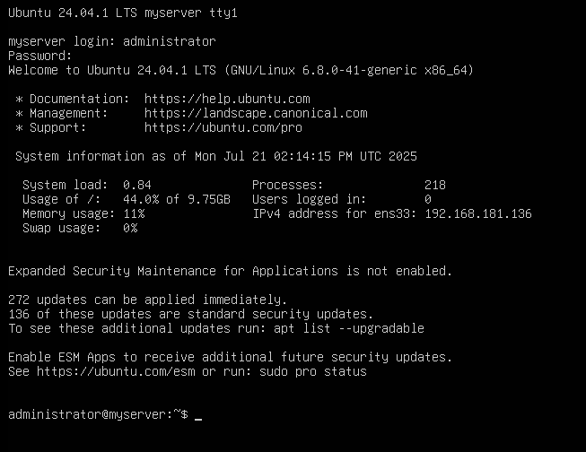

# WordPress Web Server Deployment

Selamat datang di panduan *deployment* WordPress! Proyek ini mendemonstrasikan instalasi dan konfigurasi server web berbasis WordPress di lingkungan Linux (Debian 12). Kami akan mencakup instalasi Apache2, PHP, MySQL, dan WordPress itu sendiri, serta optimasi dasar untuk operasional website yang optimal.

---

## 💡 Ringkasan Proyek

!!! abstract "Tujuan & Ruang Lingkup"
    Proyek ini bertujuan untuk membangun *full-stack web server* menggunakan **LAMP (Linux, Apache, MySQL, PHP)** di Debian 12, dengan fokus pada hosting platform WordPress. Anda akan belajar:
    *   Menyiapkan lingkungan server Linux.
    *   Menginstal dan mengkonfigurasi *web server* (Apache2) dan *database server* (MySQL).
    *   Menyebarkan aplikasi WordPress dan mengkonfigurasinya untuk akses web.

---

## ⚙️ Teknologi yang Digunakan

*   :material-linux: **Sistem Operasi:** Debian 12 (Bookworm)
*   :material-server: **Web Server:** Apache2
*   :material-database: **Database:** MySQL
*   :material-language-php: **Scripting Language:** PHP 8.x
*   :material-wordpress: **CMS:** WordPress

---

## 🚀 Langkah-langkah Implementasi


### 1. :material-access-point: Persiapan Awal Server Linux

* Silahkan login linux kalian dengan ubuntu atau debian:



*   Perbarui sistem operasi:
    ```bash 
    sudo apt update && sudo apt upgrade -y
    ```
*   Instal beberapa *utility* dasar:
    ```bash
    sudo apt install curl wget unzip -y
    ```

### 2. :material-database-plus: Instalasi & Konfigurasi MySQL

- install MySQL

```
sudo apt install default-mysql-server -y
```


- masuk ke database mysql

```
sudo mysql -u root -p
```


- lalu ketik:

```OL
CREATE DATABASE wordpress_db;
CREATE USER 'wp_user'@'localhost' IDENTIFIED BY 'passwordku123';
GRANT ALL PRIVILEGES ON wordpress_db.* TO 'wp_user'@'localhost';
FLUSH PRIVILEGES;
EXIT;
```


### 3. :material-download: Install apache2, php, dan file wordpress yang digunakan untuk web server dan side-server wordpress.

```
sudo apt install php php-mysql libapache2-mod-php php-cli php-curl php-gd php-mbstring php-xml php-xmlrpc php-soap php-intl php-zip unzip -y
```


### 4. :material-file-move: pindahkan dan beri akses file wordpress

- Masuk ke folder /tmp untuk install file wordpress. Kalian bisa ketik seperti di bawah ini:

```
cd /tmp
wget -c https://wordpress.org/latest.tar.gz
```


- lalu kalian bisa extract file tersebut:

```
sudo tar -xf latest.tar.gz
```


- lalu kalian bisa pindahkan ke file apache2:

```
sudo mv wordpress /var/www/
```


### 5. :material-lock-open: berikan akses untuk folder wordpress

- ubah user folder wordpress agar www-data dapat mengakses folder tersebut:

```bash title="Atur Izin File WordPress"
sudo chown -R www-data:www-data /var/www/wordpress
sudo chmod 755 -R /var/www/wordpress
```


### 6. :material-backup-restore: backup configurasi default configuration apache menjadi khusus untuk configurasi wordpress

- silahkan pergi ke apache2 yang berada di:

```
sudo cd /etc/apache2/sites-availables/
```

- cek isi folder dengan `ls` lalu copy untuk meng-backup default configuration:

```
sudo cp 000-default.conf wordpress.conf
```


### 7. :material-cog: configurasi file wordpress apache2

- Silahkan masuk ke file wordpress di apache dan masukan konfigurasi wordpress seperti dibawah:


### 8. :material-bell-ring: aktifkan file wordpress dan matikan file default dalam apache 2

* di step ini kalian bisa aktifkan file wordpress:

```
sudo a2ensite wordpress.conf
```


- lalu bisa matikan file default apache2:

```
sudo a2dissite 000-default.conf
```


### 9. :material-firefox: akses dengan browser

- cek ip kalian dengan `ip a` lalu masukan ke dalam browser:


### 10. :material-keyboard: masukan database linux ke dalam wordpress

- pilih languages pada halaman depan, lalu pencet selanjutnya sampai halaman forum. Dalam halaman forum, kalian masukan database yang telah kalian buat di dalam mysql


- silahkan lanjutkan dengan masukan/buat akun di wordpress:


---

## 🔓 Agar dapat diakses melewati dns dengan bind9

*  jika kalian ingin mengakses wordpress dengan dns (domain name server) silahkan ikuti langkah langkah dibawah ini:

### 1.  :material-download: install bind9

- silahkan install bind9 dengan perintah:

```
sudo apt install bind9
```

### 2. :material-file-edit: configurasi bind9 

- masuk ke folder bind9 dengan perintah:

```
cd /etc/bind/
```

- masuk ke dalam directory named.conf.local dengan perintah:

```
sudo nano named.conf.local
```

lalu konfigurasi seperti di bawah:


- copy 2 file bernama `db.local` dan `db.127`, berikan nama yang sesuai konfigurasi `named.conf.local` dengan perintah:

```
sudo cp db.local db.ip
```

- nano `db.ip` lalu konfigurasi seperti dibawah:


```
sudo cp db.127 db.domain
```

- nano `db.domain`, lalu konfigurasi seperti dibawah:


### 3. :material-tools: install powertoys

- jika sudah kalian bisa download yang bernama `PowerToys`, link dibawah:

[Download PowerToys](https://apps.microsoft.com/detail/xp89dcgq3k6vld?hl=en-US&gl=US){ .md-button .md-button--primary }

- jika sudah, silahkan di install dan otomatis microsoft akan merecomendasikan default instalasi

### 4. :material-file-edit: configurasi hosts pada powertoys

- buka powertoys dan masuk ke halaman `advanced`, lalu bisa pergi ke `hosts file editor`, dan klik `Launch Hosts File Editor` seperti gambar di bawah:


- klik `accept` jika muncul pop up, lalu buatlah entry baru dengan klik pojok atas `new entry`


- masukan domain dan ip yang telah anda buat


- dan kalian bisa akses wordpress dengan domain


## ✅ Hasil Akhir

!!! success "WordPress Berhasil Di-deploy!"
    Anda kini telah berhasil menginstal dan mengkonfigurasi WordPress di server Debian 12. Website Anda kini sudah *live* dan siap untuk diisi konten!

    .jpg){ width="800" loading="lazy" }
    <p>*Gambar 6.1: Tampilan Dashboard Admin WordPress yang sudah diinstal.*</p>

---

## 🧐 Tantangan & Solusi

!!! bug "Masalah: Error Database Connection"
    Jika Anda mengalami error `Error establishing a database connection`, pastikan:
    1.  Nama database, username, dan password di konfigurasi WordPress (`wp-config.php`) sudah benar.
    2.  User MySQL memiliki izin yang benar untuk database.
    3.  Server MySQL berjalan (`sudo systemctl status mariadb`).

!!! warning "Masalah: HTTP Error 500 atau Halaman Kosong"
    Ini seringkali disebabkan oleh masalah PHP atau izin file. Periksa:
    1.  Log error Apache (`sudo tail -f /var/log/apache2/error.log`).
    2.  Pastikan semua modul PHP terinstal dan aktif.
    3.  Izin file WordPress sudah benar (`sudo chown -R www-data:www-data /var/www/html/wordpress`).

---

## 🚀 Pengembangan Lanjutan

!!! tip "Ide Pengembangan Selanjutnya:"
    *   **HTTPS (SSL/TLS):** Integrasikan sertifikat SSL gratis (misal: Let's Encrypt) untuk mengamankan komunikasi website Anda.
    *   **Backup Otomatis:** Konfigurasi skrip atau plugin untuk backup database dan file WordPress secara rutin.
    *   **Caching:** Implementasikan solusi *caching* (misal: W3 Total Cache) untuk meningkatkan performa website.
    *   **Keamanan Lanjutan:** Terapkan langkah-langkah keamanan tambahan seperti otentikasi dua faktor, *security plugin*, atau *fail2ban*.

---


